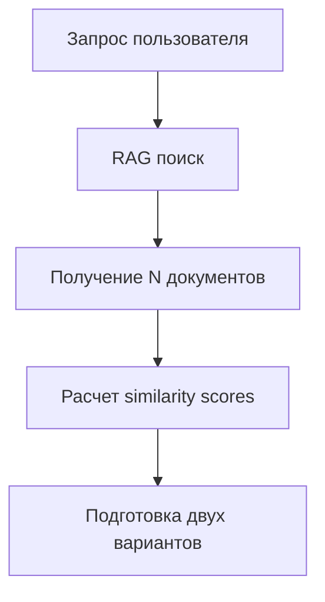

# Режим сравнения RAG с reranking и без reranking

## Обзор

Данная функция позволяет пользователям интерактивно сравнивать качество ответов RAG с применением reranking и без него. Функционал доступен только для DeepSeek модели и обеспечивает визуальную оценку эффективности алгоритма ранжирования документов.

## Архитектура решения

### Основные компоненты

#### 1. RAGComparisonManager
**Файл:** `src/rag_comparison.py`

Основной класс, реализующий логику сравнения:
- Управление состоянием режима сравнения для каждого пользователя
- Параллельная генерация двух вариантов ответов
- Сбор метрик и статистики
- Форматирование результатов для пользователя

**Ключевые методы:**
```python
async def compare_rag_responses(
    query: str,
    system_prompt: str,
    conversation_history: Optional[List[Dict[str, str]]] = None
) -> Optional[RAGComparisonResult]
```

#### 2. Интеграция с TelegramBot
**Файл:** `bot.py`

Добавлена команда `/rag_reranking` и логика обработки:
- Переключение режима сравнения (toggle)
- Проверка доступности только для DeepSeek
- Параллельная обработка сообщений
- Форматированный вывод результатов

#### 3. Метаданные и метрики

**Структуры данных:**
```python
@dataclass
class RAGComparisonMetrics:
    response_text: str
    token_count: int
    generation_time: float
    documents_used: int
    context_size: int
    documents_list: List[Dict[str, Any]]
    avg_relevance: float
    completeness_score: float = 0.0

@dataclass
class RAGComparisonResult:
    variant_a: RAGComparisonMetrics  # Без reranking
    variant_b: RAGComparisonMetrics  # С reranking
    query: str
    total_search_results: int
```

## Алгоритм работы

### Шаг 1: Инициализация
1. Проверка доступности RAG Manager и DeepSeek провайдера
2. Создание экземпляра RAGComparisonManager
3. Регистрация команды `/rag_reranking`

### Шаг 2: Активация режима
1. Пользователь вводит команду `/rag_reranking`
2. Система проверяет текущего провайдера (должен быть DeepSeek)
3. Включает/выключает режим сравнения
4. Отправляет подтверждение пользователю

### Шаг 3: Обработка запроса в режиме сравнения

#### 3.1 RAG поиск


#### 3.2 Вариант A (без reranking)
- Случайная выборка K документов из N результатов
- Сохранение исходных оценок релевантности
- Формирование контекста для LLM

#### 3.3 Вариант B (с reranking)
- Сортировка всех N документов по релевантности
- Выбор топ-K документов
- Применение reranking (если доступен)
- Формирование контекста для LLM

#### 3.4 Параллельная генерация
```python
# Выполняются одновременно
task_a = generate_response(variant_a_context)
task_b = generate_response(variant_b_context)

variant_a_metrics, variant_b_metrics = await asyncio.gather(
    task_a, task_b, return_exceptions=True
)
```

### Шаг 4: Сбор метрик

#### Для каждого варианта:
- **Токены:** приблизительный подсчет слов × 1.3
- **Время генерации:** точное время в секундах
- **Количество документов:** K документов в контексте
- **Размер контекста:** длина строки в символах
- **Список документов:** название + relevance score
- **Средняя релевантность:** среднее арифметическое scores
- **Полнота ответа:** эвристическая оценка

### Шаг 5: Форматирование результата

```
🔄 РЕЖИМ СРАВНЕНИЯ RAG

━━━━━━━━━━━━━━━━━━━━━━━━━━━━
📊 ВАРИАНТ A: БЕЗ RERANKING
━━━━━━━━━━━━━━━━━━━━━━━━━━━━

[Ответ A]

📈 Метрики:
• Токены: XXX
• Время генерации: X.XX сек
• Документов использовано: X
• Размер контекста: XXX символов

📄 Использованные документы (случайная выборка):
1. [Документ] - релевантность: 0.XX
2. [Документ] - релевантность: 0.XX
...

━━━━━━━━━━━━━━━━━━━━━━━━━━━━
📊 ВАРИАНТ B: С RERANKING
━━━━━━━━━━━━━━━━━━━━━━━━━━

[Ответ B]

📈 Метрики:
• Токены: XXX
• Время генерации: X.XX сек
• Документов использовано: X
• Размер контекста: XXX символов

📄 Использованные документы (топ по релевантности):
1. [Документ] - релевантность: 0.XX
2. [Документ] - релевантность: 0.XX
...

━━━━━━━━━━━━━━━━━━━━━━━━━━━━
💡 СРАВНИТЕЛЬНЫЙ АНАЛИЗ
━━━━━━━━━━━━━━━━━━━━━━━━━━━━

Разница в токенах: ±XX (±XX%)
Разница во времени: ±X.XX сек (±XX%)
Средняя релевантность документов A: 0.XX
Средняя релевантность документов B: 0.XX
Разница в средней релевантности: ±0.XX (±XX%)
Эффективность reranking: [улучшение/ухудшение/нейтрально]
```

## Примеры использования API

### Включение режима сравнения
```python
# В Telegram боте
/rag_reranking

# Ответ: ✅ Режим сравнения RAG включён. Вы будете получать два ответа: с reranking и без reranking
```

### Запрос в режиме сравнения
```python
# Пользователь отправляет вопрос
"Что такое Сумрак 2096?"

# Получает два варианта ответа с полной аналитикой
```

### Выключение режима
```python
# Повторный вызов команды
/rag_reranking

# Ответ: ❌ Режим сравнения RAG выключен. Возвращаемся к обычному режиму
```

## Конфигурация

### Параметры RAGComparisonConfig
```python
class RAGComparisonConfig:
    def __init__(self):
        self.enabled = False  # состояние режима сравнения
        self.random_docs_count = 5  # количество случайных документов для варианта A
        self.top_docs_count = 5  # количество топовых документов для варианта B
        self.collect_metrics = True  # собирать метрики
        self.show_document_list = True  # показывать список документов с релевантностью
        self.show_avg_relevance = True  # показывать среднюю релевантность
        self.relevance_score_precision = 2  # количество знаков после запятой для scores
```

## Обработка ошибок

### Основные сценарии
1. **Недоступность RAG сравнения:**
   - Отсутствие RAG Manager
   - Отсутствие DeepSeek провайдера
   - Нет индексированных документов

2. **Ошибки генерации:**
   - Проблемы с API DeepSeek
   - Таймауты запросов
   - Некорректные ответы API

3. **Ошибки RAG поиска:**
   - Пустые результаты поиска
   - Проблемы с индексом документов

### Логирование
Все ошибки логируются с детализацией:
```python
logger.error(f"Error in RAG comparison for user {user_id}: {e}", exc_info=True)
```

## Интеграция с существующими компонентами

### Совместимость с RAG Manager
- Использует существующий `search_relevant_context()`
- Сохраняет оригинальные similarity scores
- Интегрируется с `format_sources_info()`

### Совместимость с DeepSeek Provider
- Использует существующий клиент OpenAI
- Параллельные запросы через `asyncio.gather()`
- Сохранение метрик производительности

### Совместимость с User Settings
- Проверяет текущего провайдера перед активацией
- Сохраняет состояние режима в памяти
- Автоматическое переключение при недоступности

## Производительность и оптимизация

### Параллельная обработка
- Два запроса к LLM выполняются одновременно
- Сокращение общего времени ожидания
- Асинхронная обработка с `asyncio.gather()`

### Кэширование
- Использует существующий кэш RAG поиска
- Повторное использование результатов поиска
- Оптимизация повторных запросов

### Ограничения
- Максимальное количество документов: K=5
- Таймауты запросов: 30 секунд
- Длина ответа: автоматическое разбиение

## Расширяемость

### Дополнительные метрики
Можно легко добавить новые метрики в `RAGComparisonMetrics`:
- Стоимость запроса в токенах
- Количество использованных синонимов
- Sentiment анализ ответов
- Сходство ответов между вариантами

### Адаптивные алгоритмы
Возможные улучшения:
- Адаптивный выбор K в зависимости от количества результатов
- Умный reranking на основе семантической близости
- Машинное обучение для определения оптимального K

### Интеграция с другими провайдерами
Архитектура позволяет расширение на другие LLM:
- OpenAI с аналогичной логикой
- Yandex GPT с адаптацией промптов
- Локальные модели с доработкой интерфейса

## Безопасность и приватность

### Обработка данных
- Все пользовательские данные обрабатываются в памяти
- Никакая персистентная информация не сохраняется
- Временное хранение только в рамках сессии

### Изоляция пользователей
- Состояние режима индивидуально для каждого пользователя
- Нет пересечения данных между пользователями
- Безопасная многопользовательская работа

## Тестирование

### Unit тесты
Рекомендуемые тесты для компонентов:
```python
# Тест RAGComparisonManager
def test_rag_comparison_initialization():
def test_toggle_comparison_mode():
def test_compare_rag_responses():
def test_format_comparison_result():

# Тест интеграции с ботом
def test_rag_reranking_command():
def test_handle_message_comparison_mode():
```

### Интеграционные тесты
```python
# Тест полного сценария
async def test_full_comparison_workflow():
    # 1. Включить режим сравнения
    # 2. Отправить тестовый запрос
    # 3. Проверить результат
    # 4. Выключить режим
```

## Мониторинг и аналитика

### Логи для анализа
```python
# Пример структуры лога
{
    "timestamp": "2025-11-26T15:30:45Z",
    "user_id": 12345,
    "query": "Как настроить VPN?",
    "rag_search_results_count": 20,
    "variant_a": {
        "documents": [...],
        "avg_relevance": 0.59,
        "response_tokens": 234,
        "generation_time": 2.1
    },
    "variant_b": {
        "documents": [...],
        "avg_relevance": 0.89,
        "response_tokens": 256,
        "generation_time": 2.3
    },
    "user_preference": "variant_b"
}
```

### Метрики эффективности
- Среднее время генерации по вариантам
- Распределение релевантности документов
- Процент улучшения от reranking
- Частота использования режима сравнения

## Заключение

Режим сравнения RAG предоставляет мощный инструмент для анализа и оптимизации RAG системы. Пользователи получают наглядную демонстрацию эффективности алгоритмов ранжирования, а разработчики - ценные данные для дальнейшего улучшения системы.

Ключевые преимущества:
1. **Интерактивность** - мгновенная обратная связь
2. **Транспарентность** - полная метрика по каждому варианту
3. **Гибкость** - работа с различными типами документов
4. **Масштабируемость** - архитектура готова к расширению

Функционал полностью интегрирован в существующую архитектуру бота и не нарушает работу других компонентов.
