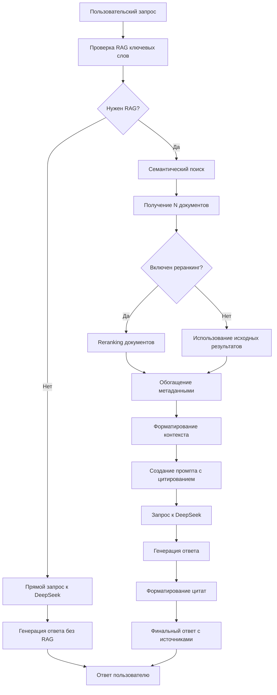

# Полный пайплайн RAG для DeepSeek

## Обзор

Документация описывает полный процесс работы RAG-системы с DeepSeek, включая реранкинг и цитирование источников.

## Архитектура пайплайна



## Детальный процесс

### 1. Анализ запроса

```python
def should_use_rag(self, user_message: str) -> bool:
    """
    Проверяет наличие RAG ключевых слов в запросе
    """
    keywords = ["документация", "как работает", "инструкция", ...]
    return any(keyword in user_message.lower() for keyword in keywords)
```

### 2. Семантический поиск

```python
# Получение расширенного списка документов для реранкинга
initial_results = searcher.search(
    query=user_message,
    top_k=context_chunks * 2,  # Удваиваем для реранкинга
    min_similarity=0.5
)
```

### 3. Reranking (опционально)

```python
if use_reranking and len(initial_results) > 1:
    reranked_results = reranker.rerank(
        query=user_message,
        documents=initial_results,
        top_k=context_chunks
    )
else:
    reranked_results = initial_results[:context_chunks]
```

### 4. Обогащение метаданными

```python
def _enrich_with_citation_metadata(self, results: List[Dict]) -> List[Dict]:
    """
    Добавляет метаданные для цитирования
    """
    for i, result in enumerate(results):
        result.update({
            'citation_index': i + 1,
            'source_file_name': Path(result['source_file']).name,
            'line_numbers': self._extract_line_numbers(result),
            'relevance_score': max(
                result.get('similarity_score', 0),
                result.get('rerank_score', 0)
            ) * 100
        })
    return results
```

### 5. Форматирование промпта

```python
def create_citation_prompt(self, user_message: str, sources: List[Dict]) -> str:
    """
    Создает промпт с требованиями цитирования
    """
    citation_instruction = """
    ВАЖНО: Вы должны включить цитаты на источники в свой ответ.
    
    Инструкция по цитированию:
    - Используйте информацию из предоставленного контекста
    - Включайте ссылки на источники в квадратных скобках [1], [2] и т.д.
    - Номер в скобках должен соответствовать номеру источника в списке
    - Ссылки должны размещаться после информации из данного источника
    """
    
    context = self.format_rag_context(user_message, sources)
    return f"{citation_instruction}\n\n{context}"
```

### 6. Генерация ответа DeepSeek

```python
async def generate_response_with_sources(self, user_message: str) -> Tuple[str, List[Dict]]:
    """
    Генерирует ответ с источниками
    """
    # 1. Обогащение RAG
    enriched_message, sources = self.rag_manager.enrich_message_with_rag(user_message)
    
    # 2. Создание промпта с цитированием
    if sources:
        prompt = self.rag_manager.create_citation_prompt(user_message, sources)
    else:
        prompt = user_message
    
    # 3. Запрос к DeepSeek
    response = await self.client.chat.completions.create(
        model="deepseek-chat",
        messages=[{"role": "user", "content": prompt}],
        temperature=0.7
    )
    
    # 4. Добавление цитат
    if sources:
        citations = self.rag_manager.format_citations(sources)
        response = response.choices[0].message.content + citations
    
    return response, sources
```

## Конфигурационные параметры

### Основные настройки

```yaml
# config/embeddings_config.yaml

# Поиск
search:
  top_k: 5                    # Количество результатов поиска
  min_similarity: 0.5           # Минимальное сходство

# Reranking
reranker:
  type: "simple"                # Тип реранкера
  params:
    weight_similarity: 0.7      # Вес сходства
    weight_length: 0.3          # Вес длины

# Цитирование
citation:
  enabled: true                 # Включить цитирование
  default_sources_count: 5        # Количество источников

# DeepSeek интеграция
deepseek_integration:
  context_chunks: 3             # Чанков в контексте
  max_context_tokens: 2000      # Макс. токенов контекста
```

### Ключевые слова для RAG

```yaml
rag_keywords:
  - "документация"
  - "как работает"
  - "инструкция"
  - "руководство"
  - "что такое"
  - "объясни"
  - "сумрак"
  - "сумрак 2096"
  # ... более 100 ключевых слов
```

## Форматы данных

### Результат поиска

```python
{
    'chunk_id': 'document_md_chunk_0',
    'source_file': '/path/to/document.md',
    'text': 'текст чанка...',
    'similarity_score': 0.85,
    'metadata': {
        'file_type': 'md',
        'char_start': 1,
        'char_end': 500,
        'token_count': 120
    }
}
```

### Результат после реранкинга

```python
{
    'chunk_id': 'document_md_chunk_0',
    'source_file': '/path/to/document.md',
    'text': 'текст чанка...',
    'similarity_score': 0.85,
    'rerank_score': 0.92,
    'citation_index': 1,
    'source_file_name': 'document.md',
    'line_numbers': '1-10',
    'relevance_score': 92.0,
    'relevance_percentage': '92%'
}
```

### Финальный ответ

```
Согласно документации [1], система поддерживает работу с несколькими LLM-провайдерами [1,2]. 
Основные компоненты включают RAG-модуль для обогащения контекста [1] и 
систему цитирования источников [3].

Источники:
[1] Источник: bot_overview.md, чанк bot_overview_md_chunk_0, строки 1-10, релевантность: 95%
[2] Источник: getting_started.md, чанк getting_started_md_chunk_1, строки 15-25, релевантность: 89%
[3] Источник: api_keys.txt, чанк api_keys_txt_chunk_0, строки 1-8, релевантность: 87%
```

## Производительность

### Метрики

1. **Время поиска**: ~50-200ms
2. **Время реранкинга**: ~500-2000ms (для Ollama)
3. **Время генерации**: ~1-3s
4. **Общее время**: ~2-5s

### Оптимизации

- **Кэширование эмбеддингов**: Уменьшает время поиска
- **Batch реранкинг**: Параллельная обработка
- **Ограничение контекста**: Контроль длины промпта

## Тестирование

### Unit тесты

```bash
# Тест компонентов RAG
python -m pytest tests/test_rag_integration.py -v

# Тест реранкера
python -m pytest tests/test_reranker.py -v

# Тест цитирования
python -m pytest tests/test_citation.py -v
```

### Интеграционные тесты

```bash
# Полный пайплайн
python -m pytest tests/test_rag_pipeline.py -v

# Тест с реальными данными
python -m pytest tests/test_real_documents.py -v
```

### Ручное тестирование

```python
from src.rag_integration import RAGManager
from providers.deepseek_provider import DeepSeekProvider

# Инициализация
rag_manager = RAGManager()
deepseek = DeepSeekProvider(api_key="...", rag_manager=rag_manager)

# Тест запроса
response, sources = await deepseek.generate_response_with_sources(
    user_message="Как работает система цитирования?",
    system_prompt="Отвечай подробно"
)

print(f"Response: {response}")
print(f"Sources: {len(sources)}")
```

## Мониторинг

### Логи

```python
logger.info("RAG pipeline started")
logger.debug(f"Query: {user_message}")
logger.info(f"Found {len(results)} documents")
logger.info(f"Applied reranking: {use_reranking}")
logger.info(f"Generated response with {len(sources)} citations")
```

### Метрики качества

- **Citation Rate**: % ответов с цитатами
- **Source Relevance**: Средняя релевантность
- **User Satisfaction**: Обратная связь
- **Performance Metrics**: Время обработки

## Troubleshooting

### Распространенные проблемы

1. **Нет RAG результатов**
   ```
   Причина: Нет ключевых слов или низкое сходство
   Решение: Проверить min_similarity, добавить ключевые слова
   ```

2. **Пустые цитаты**
   ```
   Причина: Модель игнорирует инструкции
   Решение: Снизить temperature, усилить промпт
   ```

3. **Медленный реранкинг**
   ```
   Причина: Ollama недоступен, таймауты
   Решение: Использовать SimpleReranker, оптимизировать параметры
   ```

4. **Неправильные номера источников**
   ```
   Причина: Ошибка в citation_index
   Решение: Проверить логику обогащения метаданных
   ```

### Диагностика

```python
# Проверка состояния пайплайна
stats = rag_manager.get_statistics()
print(f"RAG enabled: {stats['enabled']}")
print(f"Total documents: {stats['total_documents']}")
print(f"Keywords count: {stats['keywords_count']}")

# Тест отдельных компонентов
reranker_info = rag_manager.reranker.get_model_info()
print(f"Reranker: {reranker_info['model_name']}")
```

## Будущее развитие

### Планируемые улучшения

1. **Adaptive RAG**
   - Автоматическое определение необходимости RAG
   - Динамическая настройка параметров

2. **Улучшенный реранкинг**
   - Нейросетевые модели
   - Обучение на релевантности
   - Мультимодальный поиск

3. **Интерактивные цитаты**
   - Кликабельные ссылки
   - Предпросмотр источников
   - Контекст цитирования

4. **Оптимизация производительности**
   - Параллельная обработка
   - GPU ускорение
   - Интеллектуальное кэширование

5. **Качество ответов**
   - Fine-tuning промптов
   - Evaluation метрики
   - User feedback loop

---

*Дата создания: 28.11.2025*
*Версия: 1.0*
*Обновлено: 28.11.2025*
